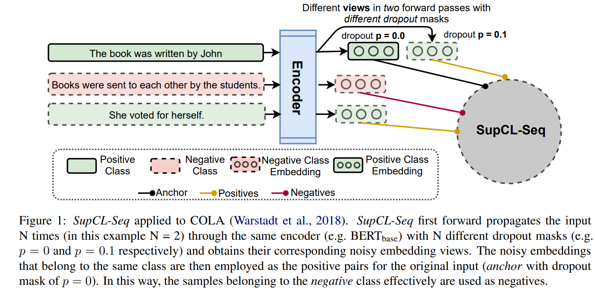
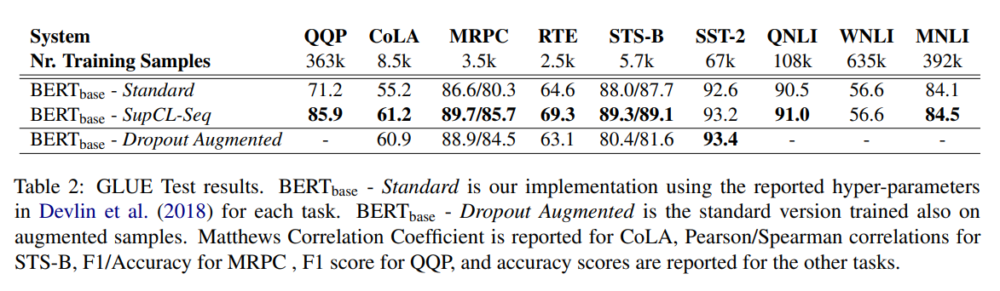

# SupCL-Seq :book:

[Supervised Contrastive Learning for Downstream Optimized Sequence representations (**SupCS-Seq**)](https://arxiv.org/abs/2109.07424) accepted to be published in EMNLP 2021, extends the supervised contrastive learning from computer vision to the optimization of sequence representations in NLP. By altering the dropout mask probability in standard Transformer architectures (e.g. *BERT_base*), for every representation (anchor), we generate augmented altered views. A supervised contrastive loss is then utilized to maximize the system’s capability of pulling together similar samples (e.g. anchors and their altered views) and pushing apart the samples belonging to the other classes. Despite its simplicity, SupCL-Seq leads to large gains in many sequence classification tasks on the GLUE benchmark compared to a standard *BERT_base*, including 6% absolute improvement on CoLA, 5.4% on MRPC, 4.7% on RTE and 2.6% on STS-B.

This package can be easily run on almost all of the transformer models in [`Huggingface`](https://huggingface.co/):hugs: that contain an encoder including but not limited to:

1. [ALBERT](https://huggingface.co/transformers/model_doc/albert.html)
2. [BERT](https://huggingface.co/transformers/model_doc/bert.html)
3. [BigBird](https://huggingface.co/transformers/model_doc/bigbird.html)
4. [RoBerta](https://huggingface.co/transformers/model_doc/roberta.html)
5. And many more!



## Table of Contents  
[GLUE Benchmark BERT SupCL-SEQ](#glue-benchmark-bert-supcl-seq)  

[Installation](#installation) 

[Usage](#usage)

[Run on GLUE](#run-on-glue)

[How to Cite](#how-to-cite)

[References](#references)

## GLUE Benchmark BERT SupCL-SEQ
The table below reports the improvements over naive finetuning of BERT model on GLUE benchmark. We employed `[CLS]` token during training and expect that using the `mean` would further improve these results.



## Installation

1. First you need to install one of, or both, TensorFlow 2.0 and PyTorch. Please refer to [TensorFlow installation page](https://www.tensorflow.org/install/pip), [PyTorch installation page](https://pytorch.org/) and/or Flax installation page regarding the specific install command for your platform.

2. Second step:

```bash
$ pip install SupCL-Seq
```

## Usage
The package builds on the [`trainer`](https://huggingface.co/transformers/main_classes/trainer.html) from [`Huggingface`](https://huggingface.co/):hugs:. Therefore, its use is exactly similar to [`trainer`](https://huggingface.co/transformers/main_classes/trainer.html). The pipeline works as follows:

1. First employ supervised contrastive learning to constratively optimize sentence embeddings using your annotated data.
 
```python
from SupCL_Seq import SupCsTrainer

SupCL_trainer = SupCsTrainer.SupCsTrainer(
            w_drop_out=[0.0,0.05,0.2],      # Number of views and their associated mask drop-out probabilities [Optional]
            temperature= 0.05,              # Temeprature for the contrastive loss function [Optional]
            def_drop_out=0.1,               # Default drop out of the transformer, this is usually 0.1 [Optional]
            pooling_strategy='mean',        # Strategy used to extract embeddings can be from `mean` or `pooling` [Optional]
            model = model,                  # model
            args = CL_args,                 # Arguments from `TrainingArguments` [Optional]
            train_dataset=train_dataset,    # Train dataloader
            tokenizer=tokenizer,            # Tokenizer
            compute_metrics=compute_metrics # If you need a customized evaluation [Optional]
        )

```


2. After contrastive training:

    2.1 Add a linear classification layer to your model
   
    2.2 Freeze the base layer
    
    2.3 Finetune the linear layer on your annotated data


For detailed implementation see [`glue.ipynb`](./examples/glue.ipynb)

## Run on GLUE
In order to evaluate the method on GLUE benchmark please see the [`glue.ipynb`](./examples/glue.ipynb)

## How to Cite
```bibtex
@misc{sedghamiz2021supclseq,
      title={SupCL-Seq: Supervised Contrastive Learning for Downstream Optimized Sequence Representations}, 
      author={Hooman Sedghamiz and Shivam Raval and Enrico Santus and Tuka Alhanai and Mohammad Ghassemi},
      year={2021},
      eprint={2109.07424},
      archivePrefix={arXiv},
      primaryClass={cs.CL}
}
```

## References
[1] [Supervised Contrastive Learning](https://arxiv.org/abs/2004.11362)

[2] [SimCSE: Simple Contrastive Learning of Sentence Embeddings](https://arxiv.org/abs/2104.08821)
